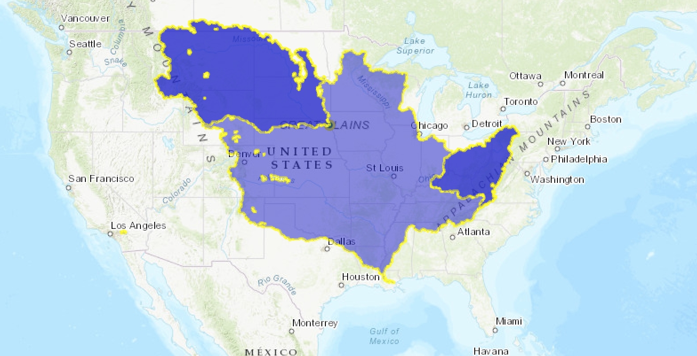

# Watershed calculator

This project calculates a watershed based on a point selected on a map.

This utilizes [ArcGIS API for JavaScript](https://developers.arcgis.com/javascript/) 4.10 together with the Hydrology geoprocessing services at hydro.arcgis.com.

Computing watersheds consumes a small amount of ArcGIS Online credits based on number of features. [See spatial analysis pricing](https://developers.arcgis.com/features/spatial-analysis/#pricing). Because of this, authentication is required to use this app.

The app runs in a web browser. If run with the proxy service enabled it can be run from anywhere. If not using the proxy, then a ArcGIS login is required and that will require running this page from a web server because of the authentication process.

This app also demonstrates authentication and proxy services. When `useProxy` is true,
the app expects to have a proxy URL setup to the watershed service. See [Access services with OAuth 2](https://developers.arcgis.com/labs/javascript/access-services-with-oauth-2/) for a tutorial and additional information about this type of authentication and setting up a proxy with ArcGIS.

When `useProxy` is false, the app creates a UI to log in an ArcGIS user with ArcGIS Online. To run this, it requires a bit of setup:

   1. You must run this from a web server (not file:// or codepen.)
   2. You must have an [ArcGIS Developer account](https://developers.arcgis.com/sign-in/). If you do not, [sign up](https://developers.arcgis.com/sign-up/) for free.
   3. You must have a Client ID created from an app. [Create a new app](https://developers.arcgis.com/dashboard/) at or [use an existing one](https://developers.arcgis.com/applications).
   4. In the app authentication definition, be sure to whitelist your web server referrer URL (e.g. http://localhost/your-app/index.html or whatever you use.)
   5. To test the proxy version you need to create a [Hydrology proxy](https://developers.arcgis.com/applications) at https://developers.arcgis.com/applications/{your-app-id}/services then select the _Services_ tab to define proxy services.
      - You must whitelist your web server referrer URL (e.g. http://localhost/your-app/index.html or whatever you use.)
      - Copy the proxy URL and paste it into `index.js` at `hydrologyWatershedProxy`. Remove the `/submitJob` URL path component from the generated proxy URL.
      - In this apps' `index.js` file set `useProxy` to `true`.
   6. To test the non-proxy version:
      - In this apps' `index.js` file set `useProxy` to `false`.
      - When the page loads, click _sign in_ and sign in with your ArcGIS for Developer's account.

### Contributing

Esri welcomes contributions from anyone and everyone. Please see our [guidelines for contributing](https://github.com/Esri/contributing/blob/master/CONTRIBUTING.md).

### License

Copyright 2017-2019 Esri

Licensed under the Apache License, Version 2.0 (the "License");
you may not use this file except in compliance with the License.
You may obtain a copy of the License at

> http://www.apache.org/licenses/LICENSE-2.0

Unless required by applicable law or agreed to in writing, software
distributed under the License is distributed on an "AS IS" BASIS,
WITHOUT WARRANTIES OR CONDITIONS OF ANY KIND, either express or implied.
See the License for the specific language governing permissions and
limitations under the License.

A copy of the license is available in the repository's [LICENSE](./LICENSE) file.
